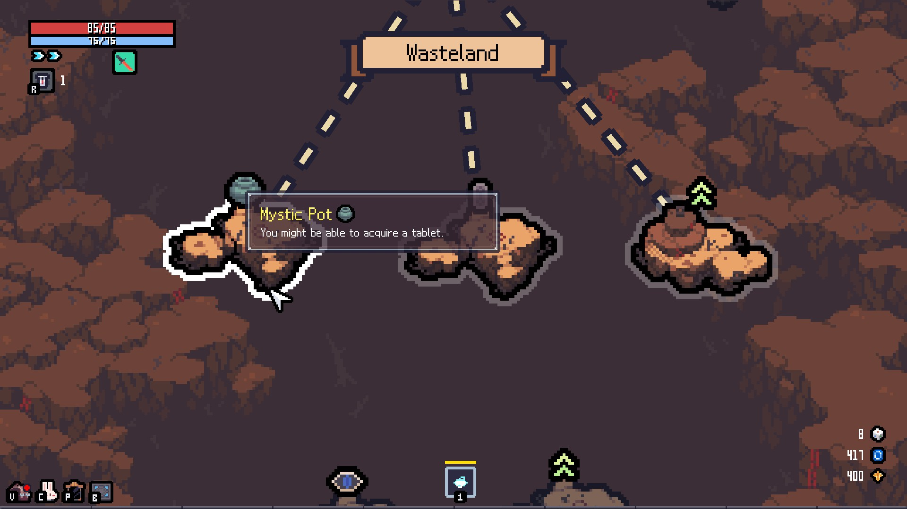
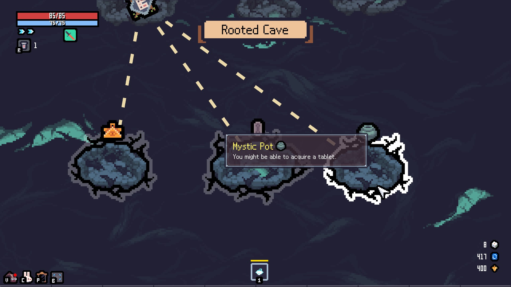

# MysticPotFloor

## 📌 Overview

This mod adds Mystic Pot stages to the 4th and 5th floors of <a href="https://store.steampowered.com/app/2436940/_/">Sephiria</a> in TEAM HORAY.

On the 4th floor, up to one Mystery Pot stage will appear.<br>
On the 5th floor, the Mystery Pot stage will appear in place of the Dice stage. (The Dice stage on the 5th floor will no longer appear.)





## 📥 Installation
1. Download the latest `MysticPotFloor-1.X.X.zip` from the Releases section and unzip it.
2. Create an `AddOns` folder inside the `Program Files (x86)\Steam\steamapps\common\Sephiria` folder.
3. Copy the `MysticPotFloor` folder into the `Program Files (x86)\Steam\steamapps\common\Sephiria\AddOns` folder.

Example:
```
Sephiria/
└── AddOns/
    └── MysticPotFloor/
        ├── Assets/
        ├── Libs/
        ├── metadata.json
        ├── MysticPotFloor.dll
        └── MiraModBase.dll
```

On your first playthrough after installing the mod, the Mystic Pot stage on the 4th floor may not appear.

## 📝 Notes
- This repository and its contributors are in no way affiliated with Sephiria, TEAM HORAY, or any related organizations.
- May conflict with other mods
- When playing in multiplayer, everyone—both the host and all clients—must have this mod installed. Please make sure everyone agrees before playing.
